# CV (REACT AND REDUX)

1. Download
2. npm install
3. npm start
4. Open http://localhost:3000 to view it in the browser

# PART OF THE APPLICATION

<ul>
<li>Home page</li>
Choose theme: light/dark
<li>About page</li>
Choose language: bosnian/english  
Choose what you want to see: resume/projects/contacts
<li>Resume page</li>
Choose what you want to see: education/internship/volonteering/skills/interesets
<li>Projects page</li>
Choose the project you want and try it!
<li>Contact page</li>
Here you can find my linkedin and github
</ul>

## Home page

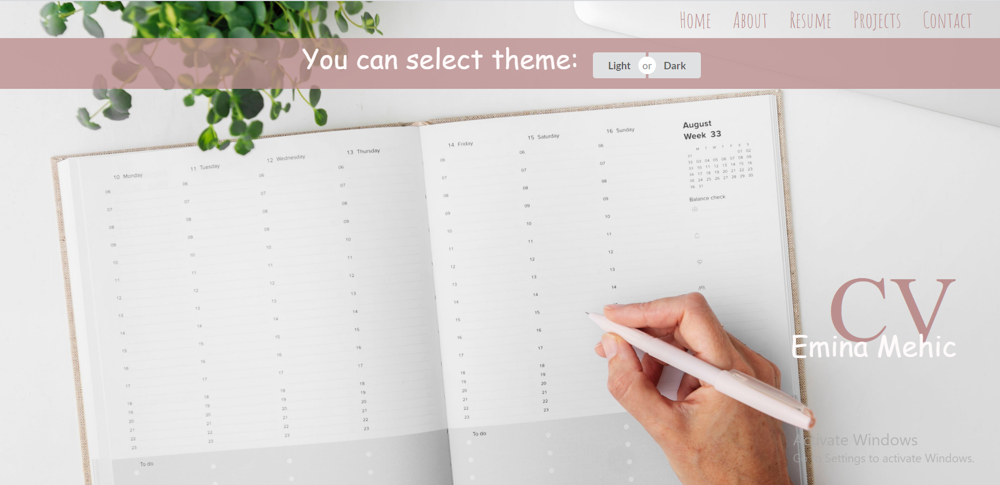

## About page

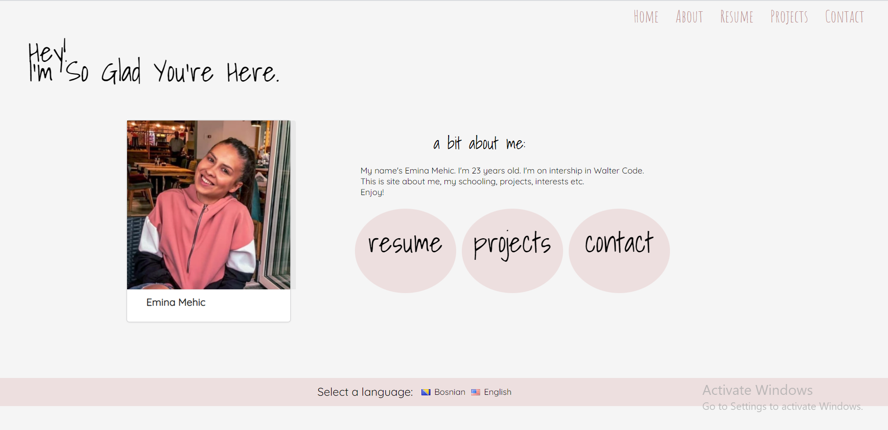
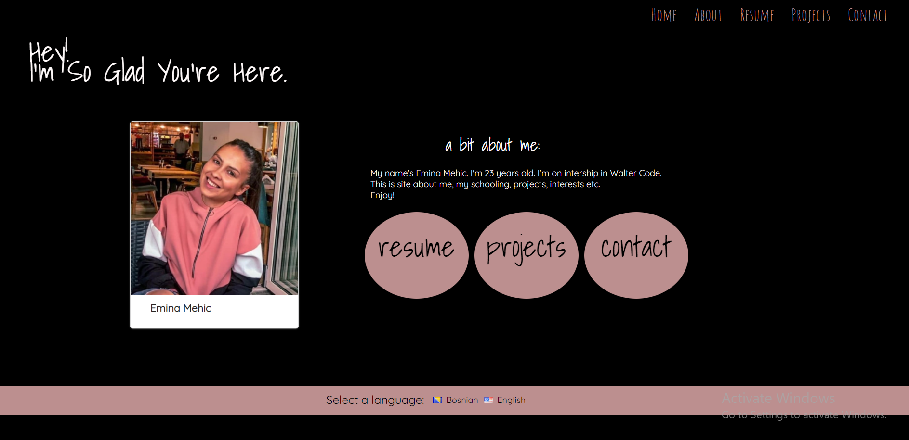

## Resume page

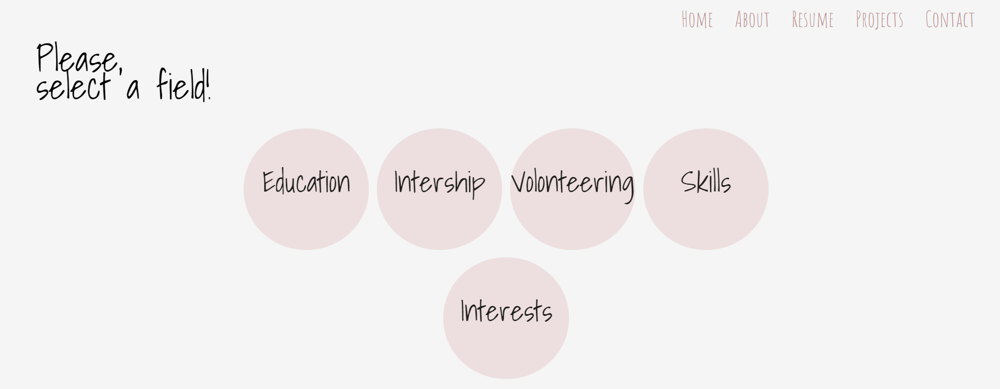
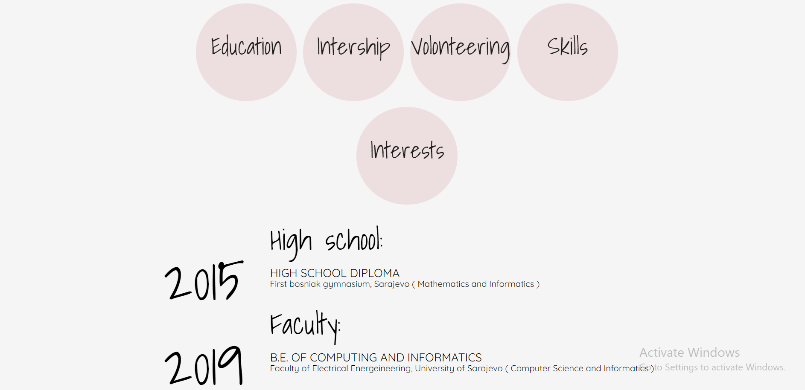
<!--

-->
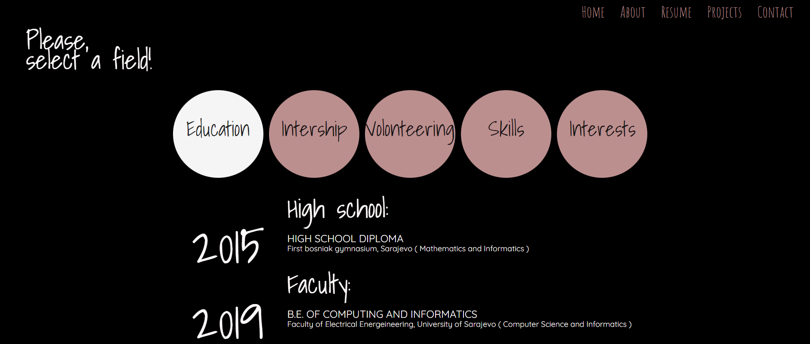

## Projects page

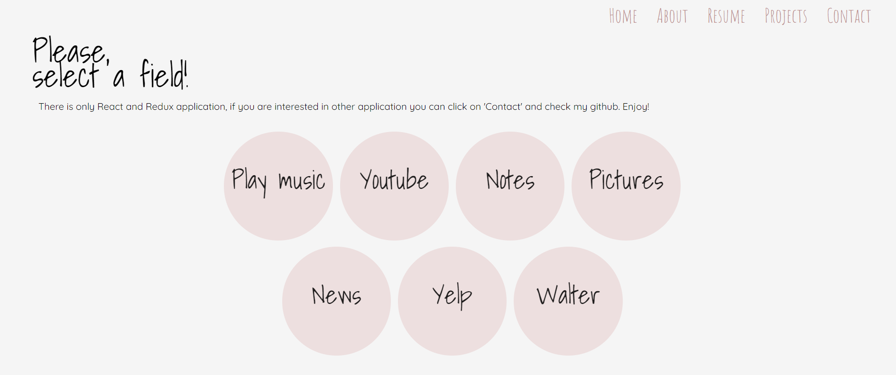
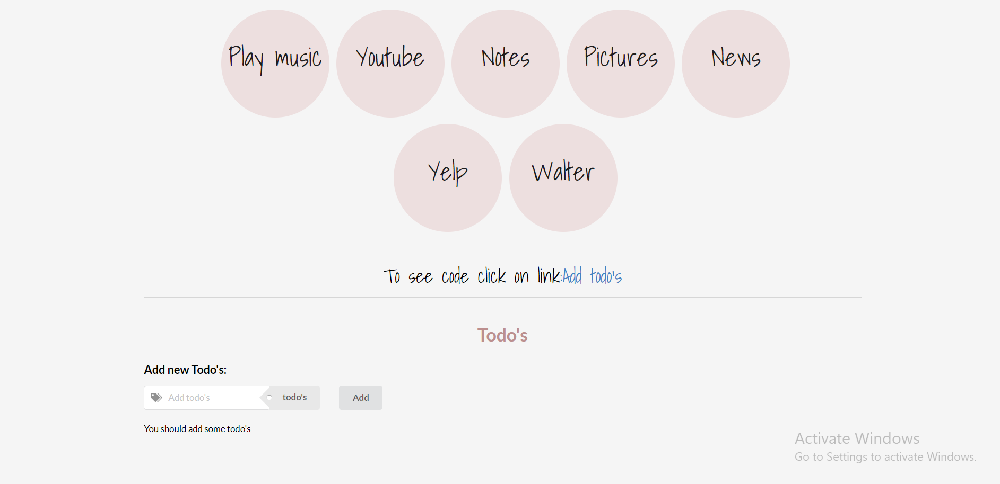
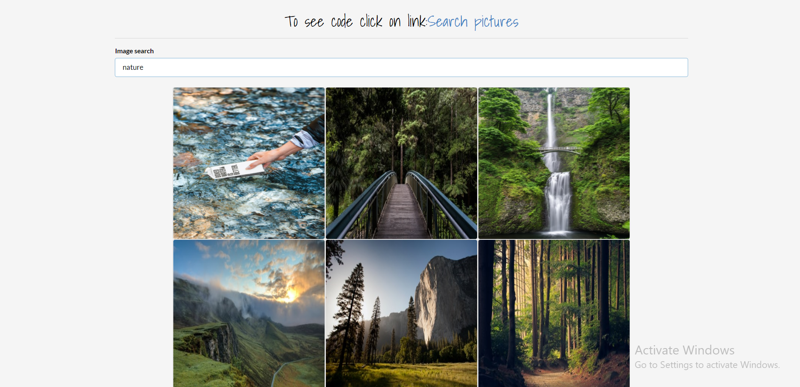
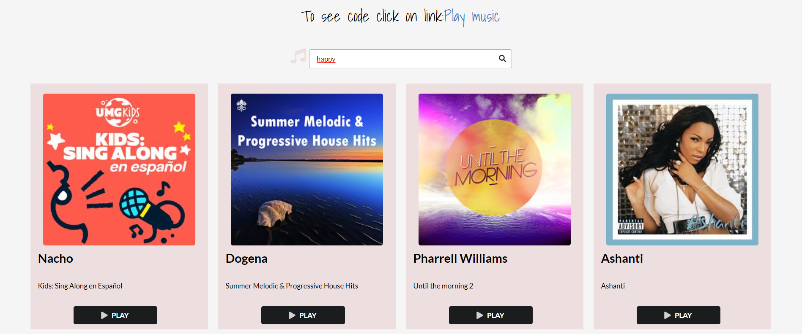
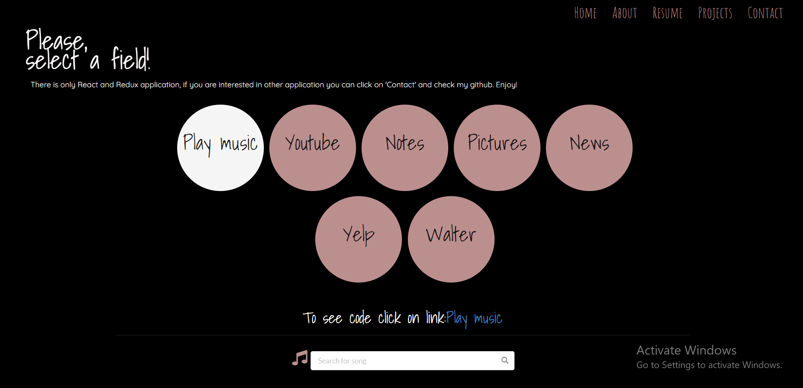

## Contact page

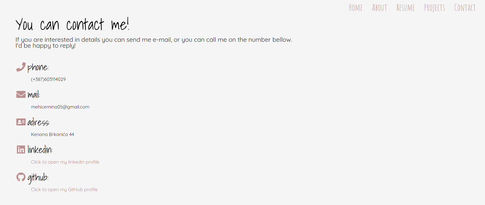
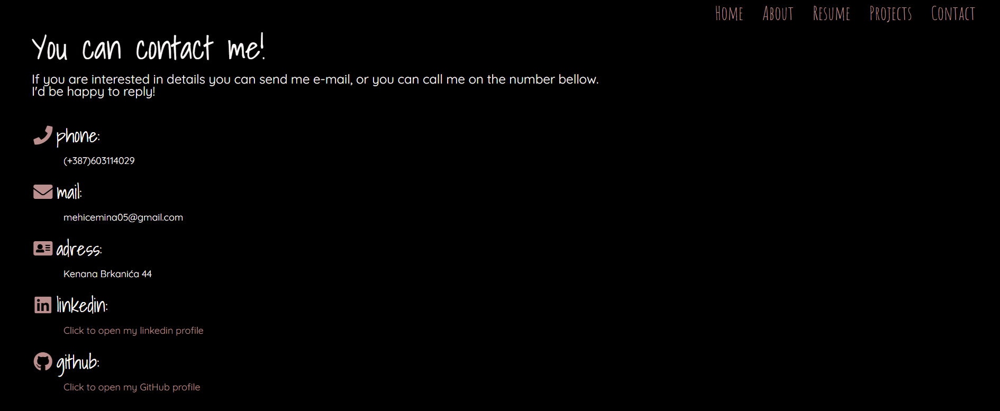

